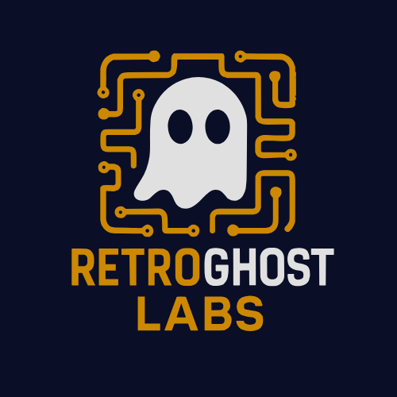

  

<h1 align="center">RetroGhostLabs, LLC</h1>

  <strong>Building intelligent software that solves real problems.</strong> 
  AI-powered applications | Music technology | Developer tools

  <a href="https://retroghostlabs.com">🌐 Website</a> •
  <a href="https://retroghostlabs.com/#contact">📧 Contact</a> •
  <a href="https://retroghostlabs.com/#projects">🚀 Projects</a>

---

## About Us

RetroGhostLabs is a software development company specializing in intelligent applications that combine cutting-edge AI with thoughtful design. We build tools that developers actually want to use, create music technology that enhances creativity, and develop productivity systems that adapt to how people work.

Our philosophy: **Clean code. Clever UX. Real impact.**

---

## 🎯 What We Build

### AI & Intelligent Systems
Building AI-powered applications that automate complex workflows, enhance decision-making, and integrate seamlessly into existing systems. From LLM-powered routing to intelligent automation pipelines.

### Music & Audio Technology
Creating tools for music tracking, analysis, and creative workflows. We understand that music technology should inspire, not complicate.

### Developer Experience
Crafting tools and libraries that make development faster, cleaner, and more enjoyable. Because great developer experience leads to great software.

---

## 🛠️ Our Stack

**Core Languages**  
TypeScript • JavaScript • Python • Java • C#

**Frameworks & Runtime**  
Node.js • React • Express • Unity • .NET

**Infrastructure & DevOps**  
AWS • Docker • MongoDB • PostgreSQL • GitHub Actions

**Specializations**  
- AI/ML Integration & LLM Orchestration
- Audio/Media API Development
- Automation & Workflow Systems
- Game Development & Interactive Experiences

---

## 👻 The Head Ghoul

RetroGhostLabs is led by **Shaun McGuire**, who brings expertise in full-stack development, AI integration, and building tools that solve real problems.

👤 **[Check out Shaun's personal GitHub](https://github.com/retroghostlabs)**

---

## 🔒 Our Repositories

Most of our active development happens in private repositories as we build and refine products for release. We're committed to quality over quantity and believe in launching products that are truly ready.

**Looking for something specific?** Reach out—we're happy to discuss our work and explore collaboration opportunities.

---

## 🤝 Let's Work Together

We're open to:
- **Strategic Partnerships** – Building the future together
- **Custom Development** – Tailored solutions for unique challenges
- **R&D Collaboration** – Pushing boundaries through research
- **Consulting Services** – Leveraging our expertise for your project

**Interested in collaborating?**  
📩 [Get in touch](https://retroghostlabs.com/#contact)

---

  © 2025 RetroGhostLabs, LLC. All rights reserved. 
  Crafting software with purpose and precision.

