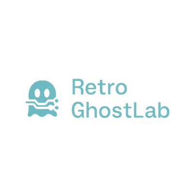

  

# 👻 RetroGhostLabs, LLC

**AI-powered apps, music tools, and productivity systems — crafted with clean code and clever UX.**

At RetroGhostLabs, we design and build software that blends innovation, functionality, and fun.  
From AI-driven developer tools to music analysis platforms, our mission is to turn ideas into polished, impactful products.

---

## 🚀 What We Do
- **AI & Automation** – Intelligent logic flows, automation systems, and productivity enhancers.
- **Music & Creativity Tools** – Apps for music tracking, analysis, and creative workflow.
- **Developer Experience** – Tools that make coding faster, cleaner, and more enjoyable.

---

## 🛠️ Technology We Love
- **Languages:** TypeScript, JavaScript, Java, Python  
- **Frameworks:** Node.js, React, Express, MongoDB  
- **Cloud & DevOps:** AWS, Docker, GitHub Actions  
- **Specialties:** AI/ML Integration, Audio/Media APIs, Automation Workflows

---

## 🤝 Collaboration
While our active projects are private, we’re always open to:
- Strategic partnerships
- Custom software solutions
- Research and development collaborations

If you’re interested in working together:  
📩 **[Contact us](https://retroghostlabs.com)**

---

**© 2025 RetroGhostLabs, LLC — All rights reserved.**
